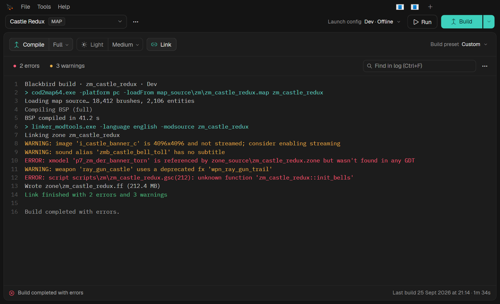
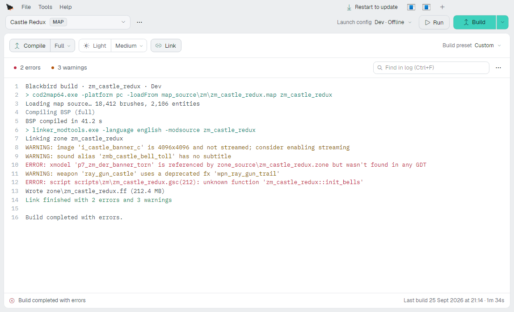
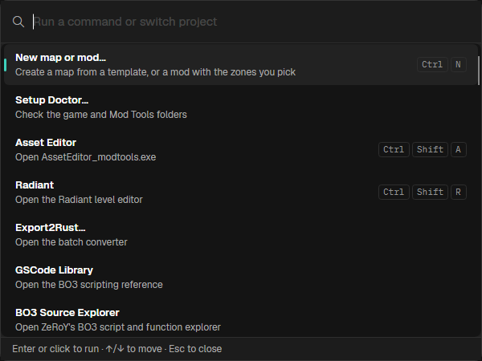

<p align="center">
  
</p>

<h1 align="center">Blackbird</h1>

Blackbird replaces the Black Ops III Mod Tools Launcher. It builds, runs and publishes your maps and mods the
same way Treyarch's launcher does, and it is quicker to use: one window, a keyboard shortcut for everything you
do daily, and nothing you have to configure before it works.

It installs as `modlauncher.exe` in your `bin` folder, so launching the Mod Tools from Steam, or from any
shortcut you already have, opens Blackbird.

<p align="center">
  
</p>

<p align="center">
  
  
</p>

<p align="center"><sub>The screenshots show a made-up project, <i>Castle Redux</i>, in the dark and light themes, and the Ctrl+K command palette.</sub></p>

## What it does

- Builds maps and mods: compile, lighting and linking, with presets for the steps you run together. The build
  log streams as it runs, and errors and warnings are counted and filterable.
- Runs the game in a Dev or Ship launch config, offline or through Steam, with the dvars and run options you
  set per project.
- Publishes to the Steam Workshop from inside Blackbird. Each project can hold several Workshop versions
  (a stable item and a test item, say), and Blackbird checks the title, images and build before it uploads.
  Drafts live in `workshop.profiles.json` and gallery images in `workshop_media`, both beside the `zone`
  folder, so only `workshop.json` and the built files go up to Steam.

- Creates maps from Treyarch's templates and mods with the zones you choose, and renames or duplicates
  projects without leaving stale names inside the files.
- Finds common project problems, such as a `#using` that points nowhere or duplicate GDT assets.

## Requirements

- Windows 10 or 11, 64-bit
- Call of Duty: Black Ops III and the Black Ops III Mod Tools, installed through Steam
- The [.NET 10 runtime](https://dotnet.microsoft.com/download/dotnet/10.0) (the installer tells you if it's
  missing)

## Installing

Download `blackbird-setup.exe` from the Releases page and choose Install. It puts
`modlauncher.exe` and `steam\steam_api64.dll` into `<BO3>\bin`, and keeps Treyarch's launcher in a hidden
`bin\.gscode-backups` folder.

Blackbird updates itself: when a new release is out it downloads it in the background and shows Update ready
in the title bar, where you choose Install now or Install on close. Help > Check for updates checks straight away.
If a Steam "Verify integrity of game files" puts Treyarch's launcher back, open the setup and choose Reinstall.

## Uninstalling

Open the installer and choose Uninstall. It puts Treyarch's launcher back and removes everything it added.

To do it by hand, with the Mod Tools closed:

1. Move `modlauncher.exe` from `<BO3>\bin\.gscode-backups\` up into `<BO3>\bin\`, replacing the file there.
   The folder is hidden; in File Explorer choose View > Show > Hidden items.
2. Delete `<BO3>\bin\.gscode-backups\` and `<BO3>\bin\steam\`. Leave `<BO3>\bin\steam_api64.dll` alone; it's
   Treyarch's.

Or verify the Mod Tools in Steam (right-click Call of Duty: Black Ops III - Mod Tools, then Properties >
Installed Files > Verify integrity of game files), then delete `bin\steam\` and `bin\.gscode-backups\`, which
Steam leaves behind.

Blackbird's own settings and build logs are in `%APPDATA%\Blackbird`. Delete that folder to remove them.

## Keyboard shortcuts

| Shortcut | Action |
| --- | --- |
| Ctrl+K | Command palette: every action and project |
| Ctrl+P | Switch project |
| Ctrl+N | New map or mod |
| Ctrl+B | Build |
| F5 | Build and run, or run, depending on the build mode |
| Ctrl+F | Find in the build log |
| Ctrl+Shift+U | Publish to the Workshop |
| Ctrl+Shift+A | Asset Editor |
| Ctrl+Shift+R | Radiant |

## Troubleshooting

If Blackbird closes on launch, check `%APPDATA%\Blackbird\crash.log`. On a graphics driver it can't render
with, start it with `--software-render`.

## Building from source

You need the .NET 10 SDK.

```
dotnet build Blackbird.slnx -c Release
dotnet publish Blackbird/Blackbird.csproj -c Release -o out
```

`out` then holds `modlauncher.exe` and `steam\steam_api64.dll`, laid out as they go in `<BO3>\bin`.

`Blackbird.Shots` renders every window and dialog with fake projects and checks the main interactions with
real keyboard and mouse input, without touching your install or Steam:

```
dotnet run -c Release --project Blackbird.Shots
```

Screenshots land in `Blackbird.Shots/shots/`.

## Licence

Blackbird is released under the [MIT licence](LICENSE).

It bundles files that are not covered by it: `steam_api64.dll` is Valve's Steamworks library, used under
Valve's terms, and the Geist and IBM Plex Mono fonts are under the SIL Open Font License (the licence texts sit
beside them in `Blackbird/Assets/Fonts`).
